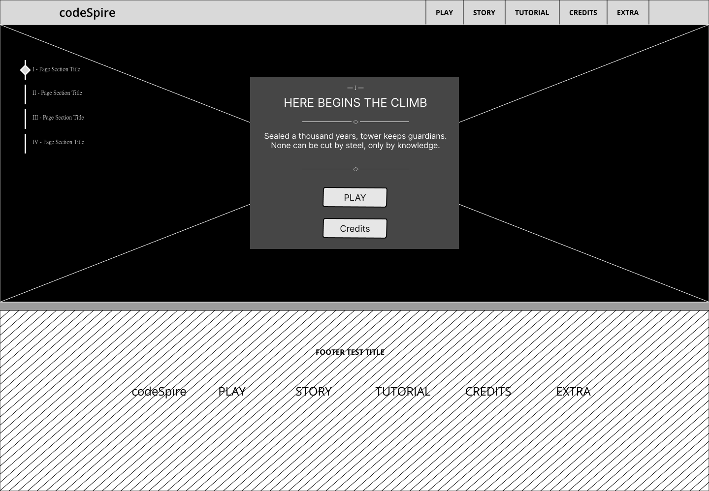
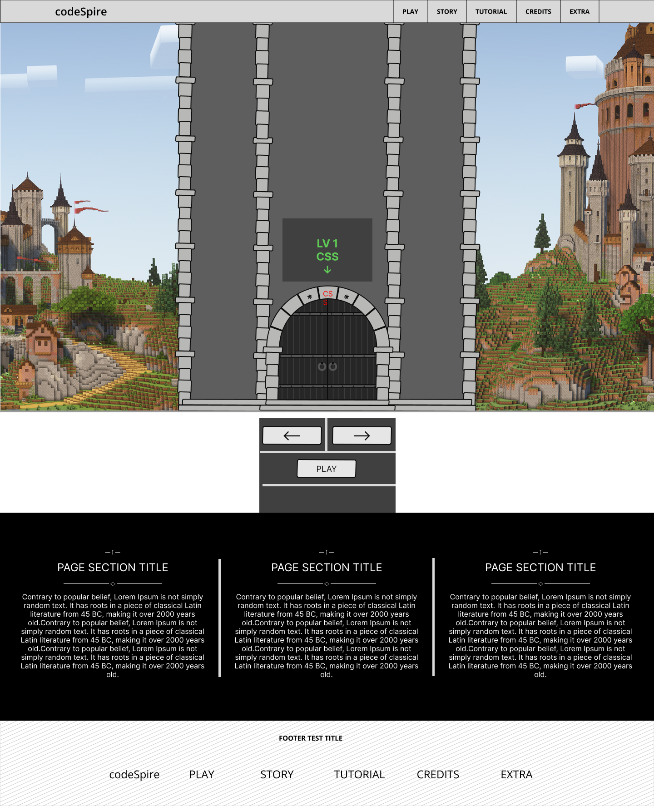
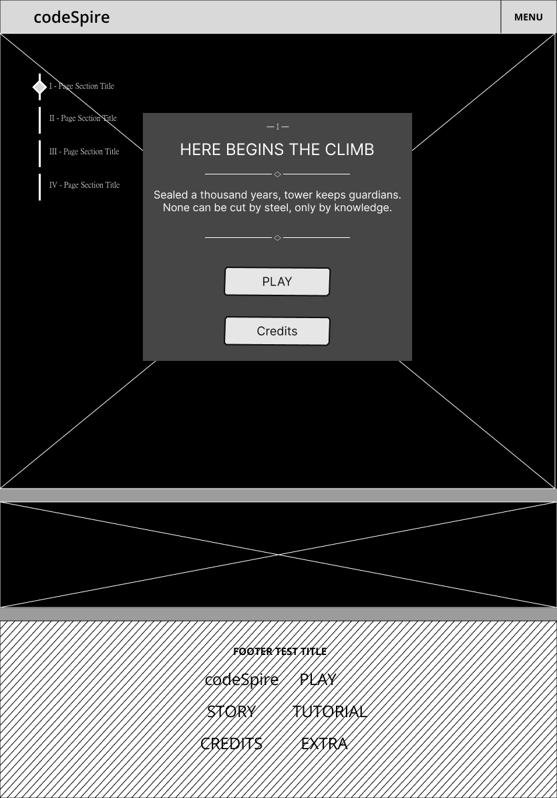
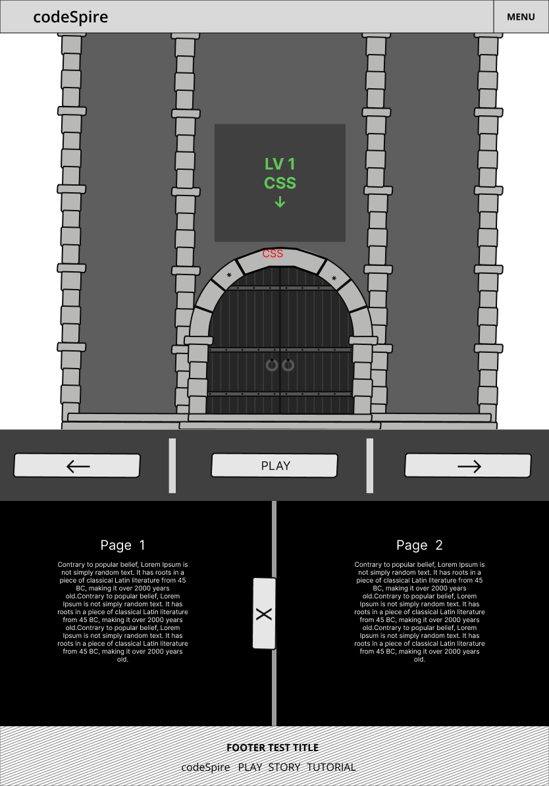
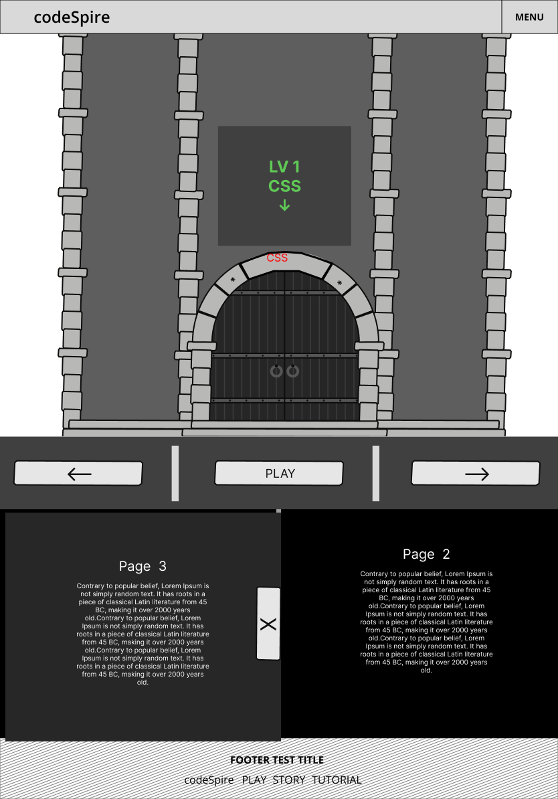
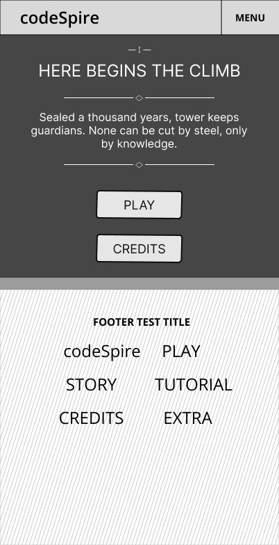
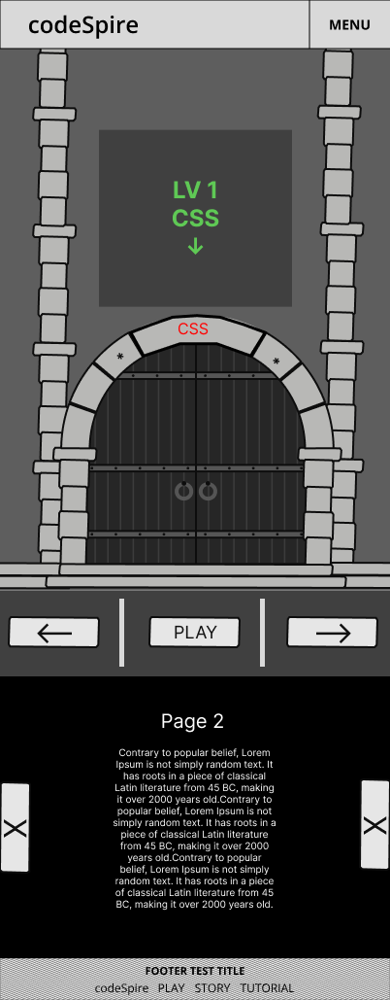
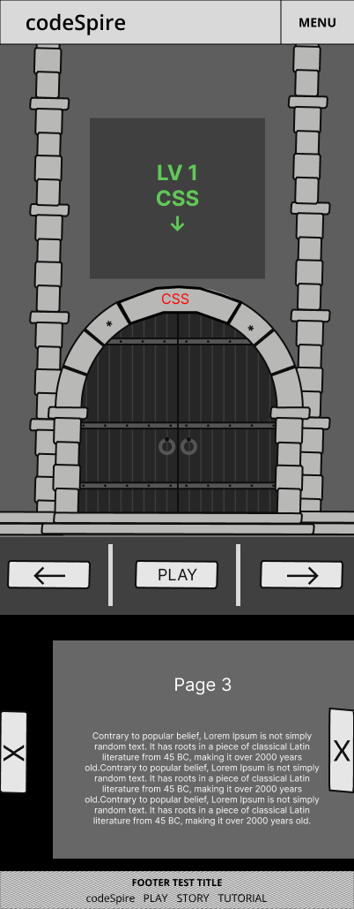

# Figma Design Link - Guest View

Figma design [here](https://www.figma.com/design/BC0MyUMRgNGACaPtwx7HoR/Website-Design-Group-8?node-id=0-1&t=9CZlyraSfUcVhFSe-1)

# Brainstorming website design

# Figma low fidelity design iterations

## Desktop

### Desktop landing page

### Desktop lobby page

## Tablet

### Tablet landing page

### Tablet lobby page

## Mobile

### Mobile landing page

### Mobile lobby page

## Combined - Desktop, Tablet and Mobile

### Singleplayer Page

### Character Creation Page

### Credits Page

