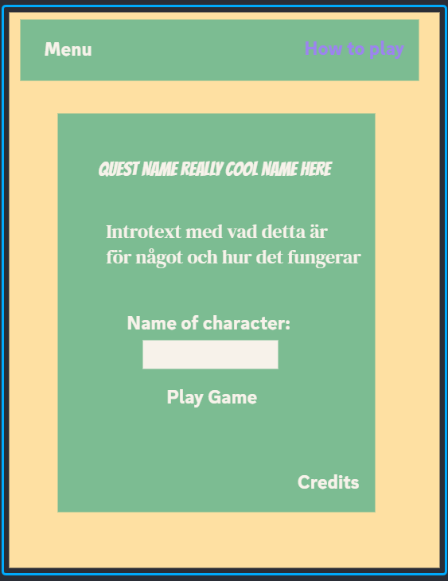
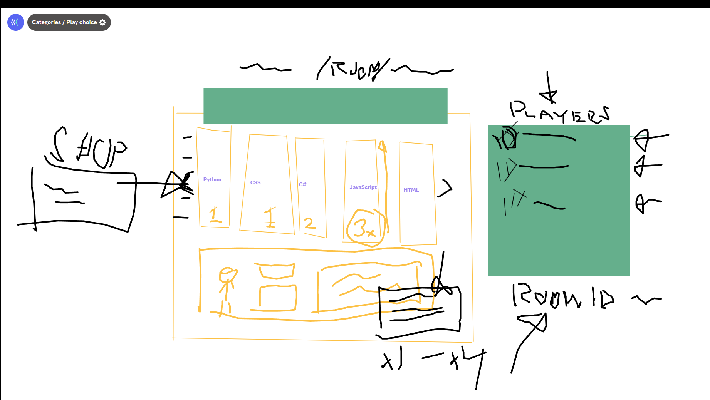
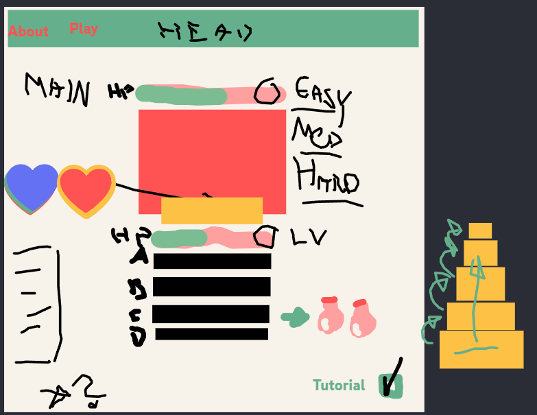

Mattias set as scrum master.

The group decided between making a: "RPG battler", a Live crime map, a "Should I buy this" or a vacation planner app.
RPG battler won the poll.

We started on making the base design of the UI and some ground concepts using a whiteboard app.

We then made poll #2 deciding between increasing difficulty throughout the rounds or a set difficulty chosen at the start of a game.
Dynamic difficulty won.

Proceeded to decide if we should use a hero-class system and items.

We need to make tutorial/hints so it becomes easy to understand and fast to pick up.

A multiplayer/coop mode would be fun.

Hearts vs Bar for health.
We're going with the classic hearts style hp.

After that we started thinking about how the game will greet visitors. Will we have a splashscreen? Will the game load assets while in a potential character creation menu or a quick loadscreen after e.g. pressing "press here to play".

We should have a credits screen.

Colorpalate poll with themes from <a href="color.adobe.com/explore">adobe</a>.
"Dark Forest", "dark-green-forest", "Dark Forest Green 4", "Night in the forest", "Forest cosy dark", "final".

A mix of "Dark forest" and "Night in the forest" won:
#040505
#14191C
#182420
#232D18
#763D28
#84692B
#423822
#524C29
#58483C
#72604A
----

The game will be educational and you get to chose between different towers, each tower being a trivia with its own category. Repeated clears of a tower increases its level and difficulty. Tower categories will be: Python, CSS, C#, JavaScript, HTML... And probably even more similar categories.

Partymenu in the "lobby" where you chose tower(map).
Should the level of the towers be based on the host, the lowest, the highest or a "new run" per unique party.

If we want leaderbords we need a serverhost and logins. Logins means we need emails and thus GDPR will apply which in turn means loads of rules and regulations. Would be nice but probably a goal for the future in that case.

Figma will be used for the groundwork that we will later use to design the website from.

Start with sketches and then make wireframes before moving on to the high fidelity version. (Konan + Alena).

Start with index and dependencies. (Mattias + Felix).

We will base our "storypoints" on ranks (as seen in The Elder Scrolls.)
Novice: Half a days work.
Apprentice: One days work.
Adept: Three days work.
Expert: One weeks work.
Master: Two weeks work.

Storypoints

---

| Objective                                               | Rank       | Result |
| ------------------------------------------------------- | ---------- | ------ |
| Figma Wireframe                                         | Novice     |        |
| Figma Mid-fidelity                                      | Novice     |        |
| Figma High-fidelity                                     | Apprentice |        |
| Tutorials, Indexing, Dependencies, Scripts osv planning | Novice     |        |
| API-What can we do                                      | Novice     |        |
|                                                         |            |        |
|                                                         |            |        |

Responsive layout (on all pages).
Add Dialog <--
CSS all pages (CSS for design/theme, not responsivity)
JavaScript + API groundwork.
SEO A11y Performance etc.

---

HTML Planning:
<ul>
<li>Header/nav + Footer</li>
<li>Main/Body</li>
<li>Stage select/Lobby.html</li>
<li>Singleplayer.html</li>
</ul>
Each node will be worked on by one person.

Todo for tomorrow:
Come up with a project name/game name, three suggestions per person.

# Sketches

Landing Page:  
  
Lobby Page:  
  
Fighting page:  

